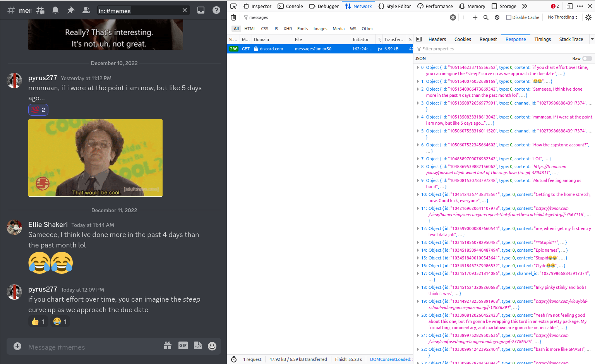
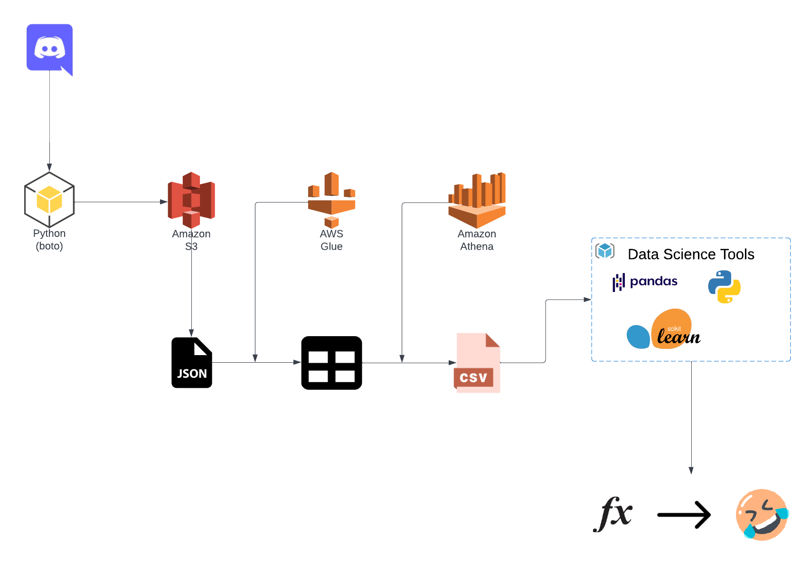
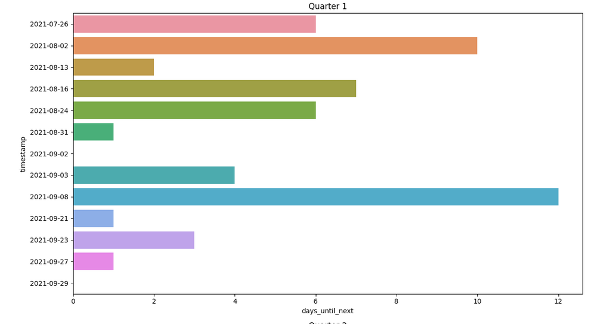

# Capstone Submission: Report
---

My project explores an area of sentiment analysis that the most Americans are at least somewhat concerned about: how reaction-inducing are their social media posts? In particular, how effective are they at posting _funny_ content?  

It's probably not wrong to say humor is subjective, so instead of trying to create a model that can produce Key & Peele levels of generalizable gag material, I focused on specific groups of people: my former batchmates when I was an associate at Revature and my data science colleagues at Brainstation. Being a member of both their Discord servers, I was able to compile message data that contained the following details:  

1. **Content** of the message
2. **Date and time** the content was submitted
3. Emotic **reactions** (if any)  

 My strategy was to employ Natural Language Processing techniques on this data to create a model that can predict if a message received either a 😂 or 🤣 reaction.  
 
 The value such a model would provide includes features for application development (e.g. as a user writes a post, inform the user in real-time that the post is likely to get a positive reaction) or for automation (e.g. a Discord bot that periodically reacts to messages in a manner that's expected by a human user).

## Process  

To obtain my data I made use of an idea I inspired by [a Medium article](https://hongchai.medium.com/scraping-discord-channels-d5de7ee87abe), where you visit the Discord channel like you normally would on your browser, and use the browser's developer tools to figure out where and how the browser makes a request to obtain the messages it renders to the user.  

  

I tried several methods to prepare the data for analysis and modeling. Originally I tried doing things programmatically in Python (e.g. creating Python classes to map JSON to the dataframe I want), but found a more streamlined way of data processing through [AWS Glue](https://aws.amazon.com/glue/) and [AWS Athena](https://aws.amazon.com/athena/). Glue would take my scarped JSON data in an AWS S3 bucket and convert it to relational table, then with Athena I could make SQL queries and get the outputs of those queries as a CSV.  

  

This allowed for me to use a simple Logistic Regression on the tokenized content, and while the final model failed to identify many of the funny messages, the ones it did identify were more likely to have had funny emoji reactions than not (this is on a data set that was split roughly evenly between "funny" and "not funny").  

While this model would not perform particularly well in identifying repeated attempts to post a funny message, it could serve as a Discord bot that, because of it's relatively high precision will react to messages that are actually meant to be funny.  

Another consideration that would supplement such a feature (the Discord bot) is determining if the chances of a funny message being posted increases significantly if a funny posting was made within a given timeframe. This is based on the assumption that a funny comment can lead to a "streak" of funny content being posted in response.  

To explore this, I divided the data into six annual quarters and plotted compared the days elapsed until the next funny comment was posted over time.  

  

The width of the bar and its variation across time suggest that funny comments do in fact happen in "spurts." For a Discord bot, this would mean increasing the likelihood of the bot reacting to a message if one has already been posted.  

For the next sprint I want to focus on developing a more autonomous pipeline, from data ingestion to the final model. I would also try to apply the model in some way, whether it be a bot or otherwise.

